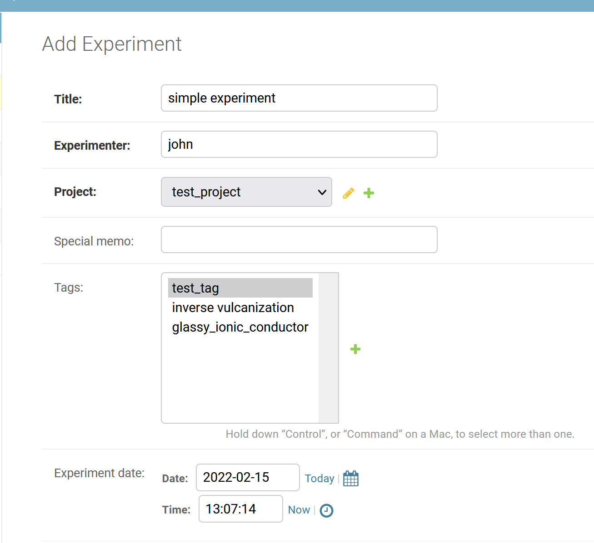
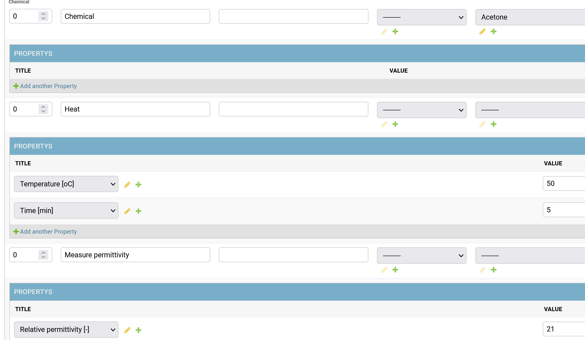
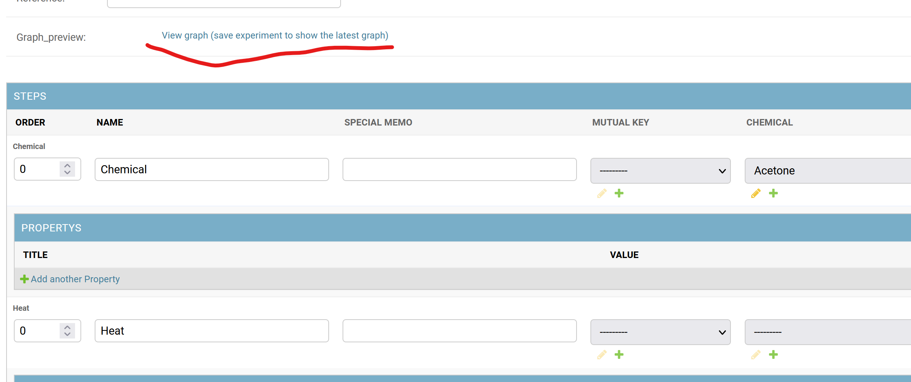
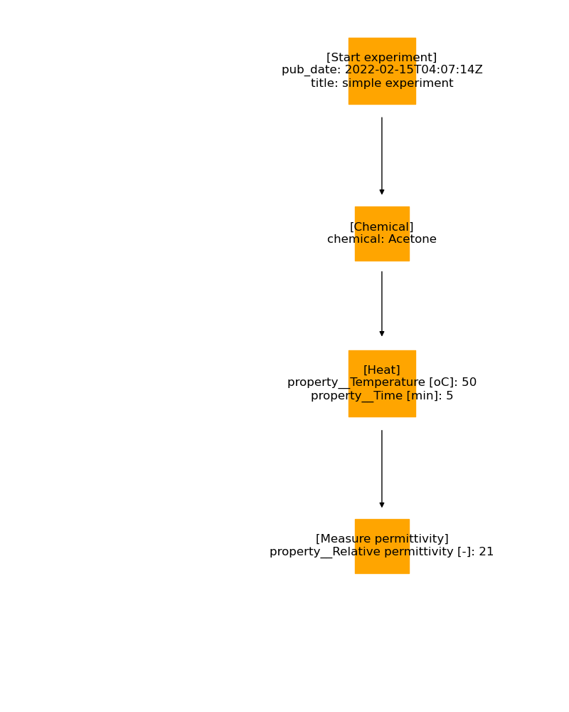
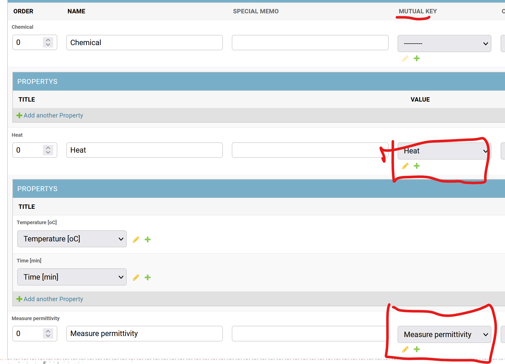
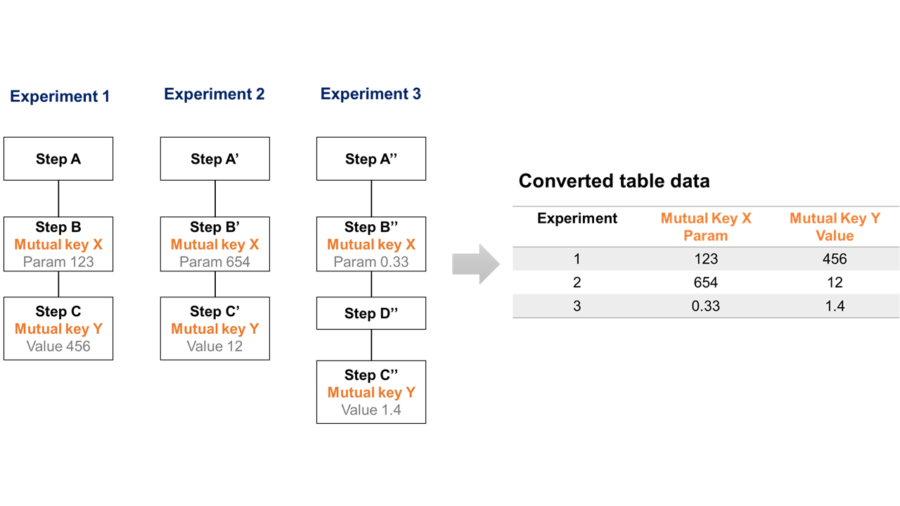
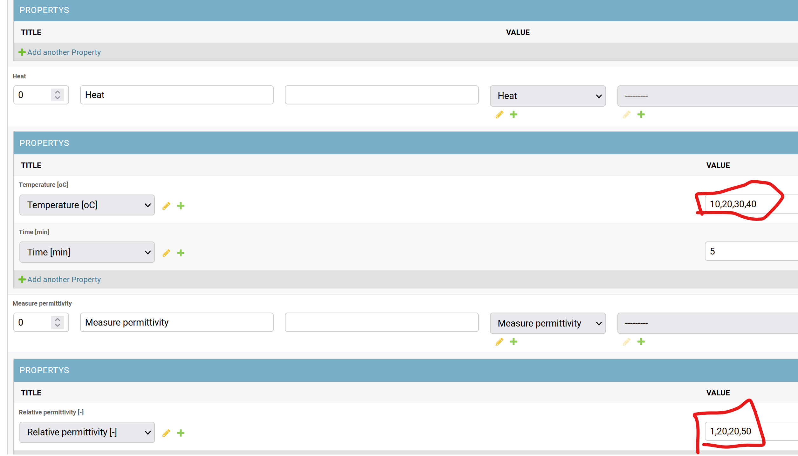

# Register experiments
## What are experiments?
- Here, you can imagine "Experiments" as a kind of flowrcharts
- An experiment consist of following components
    - General information
        - Title, experimenter, date, ...
    - Steps
        - Each experimental protocol is recorded here
        - You can refer chemicals, mixtures, other experiments, etc.

## Example: Simple experiment
### Preparation
- Let's record a very simple experiment:
    1. Prepare acetone
    2. Heat it at 50 oC for 5 min
    3. Obtaining relative permittivity of 21

- Move to "Add experiment" page
- Set basic parameters as you like
    - You should set "Project"
        - This value is necessary for exporting processes

- Move to the "STEPS" section
- As the first step, set acetone information
    - Name: your favorite step name
    - CHEMIAL: select acetone
    - Other forms: Leave as blank

- Add the second step
    - Following is an example

- Add the last step
    - Following is an example

### View flowchart
- Save the experiment
- Click "View graph" button

- You will see the following kind of graph, if successfully made.

## Example: Add another experiment with similar condition
### Overview
- Let’s consider the case of changing temperature
    - Exp1 (same as above)
        - Prepare acetone
        - Heat it at **50** oC for 5 min
        - Obtaining relative permittivity of **21**
    - Exp2 (new one: note that the values are imaginary)
        - Prepare acetone
        - Heat it at **60** oC for **15** min
        - Obtaining relative permittivity of **30**

### Set mutual key
- Set Mutual key for the two steps

#### NOTE: What is Mutual key?
- "Mutual key" works as a landmark during conversion of graphs into a table 
- Following is an example image, showing the function of "Mutual key"

### Duplicate experiment
- Go back to the experiment view
- Click "Duplicate experiment" button

- If you reload the page, a new experiment will appear.

### Edit another experiment
- Open the newly generated experiment
- You can change experiment title as you like
- Set new values

### Convert to table data
- For machine learning, graph-shaped data are often difficult to treat
- The system can automatically convert graphs into a table data
1. Go back to the experiment view
2. Select experiments to be converted
3. Select action
    - Export table
        - Exporting normal table
    - Export fingerprinted table
        - Table with fingerprints
            - Algorithm
            - https://chemrxiv.org/engage/chemrxiv/article-details/61ee04a671868d22fdbc8856
        - JSON
            - For programmers!
4. Click "Go" button
    - Conversion takes some time
    - By default, csv files will be downloaded

### View converted data
- If you change the setting of "expmanager/utils/sql_converter/table_generator.py" (PANDAS_MODE=False), [dtale module](https://github.com/man-group/dtale) can be used to view the table data

### Inputting many variables in a single experiment
- Split multiple variables with comma (,) to express multiple experiments
- The following expression equals to four experiments with different variables.
    - Temperature = 10, permittivity = 1
    - Temperature = 20, permittivity = 20
    - Temperature = 30, permittivity = 20
    - Temperature = 40, permittivity = 50

